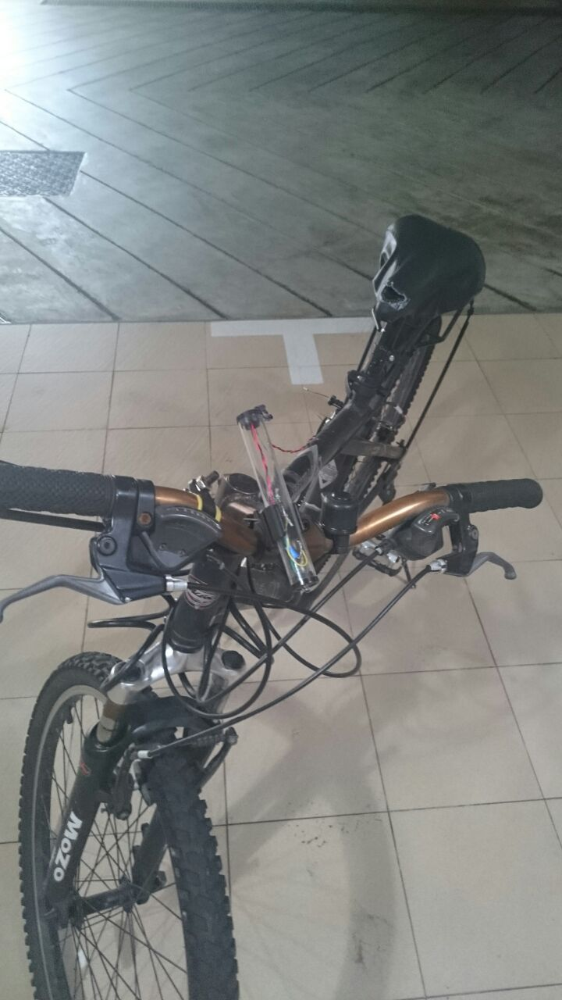

I saw this bottle dynamo on sale at Sim Lim towers and learnt that bottle dynamos could be retrofitted on most bicycles and decided to try to add it on my bike. I learnt to make a diode bridge to change the AC circuit into DC, and put a capacitor over the circuit so that the light would not blink. Pretty simple circuit, and the results were decent although not very pretty.

